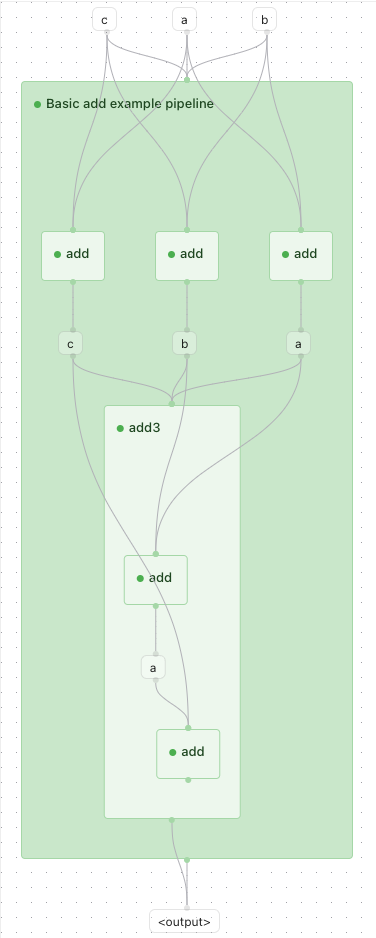

Sematic Functions are the base unit of work in your pipelines. That is where you
will implement all the business logic related to your pipeline steps.

Inputs and outputs of Sematic Functions are serialized and tracked in the
database (see [Artifact tracking](#artifact-tracking)), and the status of the
execution is also tracked (see [Execution status](#execution-status)).

Sematic functions are visualizable as Runs in the UI. They are displayed as
nodes in the [Graph Panel](./sematic-ui.md#graph-panel) and listed in the [Menu
Panel](./sematic-ui.md#menu-panel) under "Nested runs".

## Nested Sematic Functions

Just like regular Python functions, Sematic Functions can be arbitrarily nested.

Take this toy example:

```python
@sematic.func
def add(a: float, b: float) -> float:
    return a + b

@sematic.func
def add3(a: float, b: float, c: float) -> float:
    return add(add(a, b), c)

@sematic.func
def pipeline(a: float, b: float, c) -> float:
    sum1 = add(a, b)
    sum2 = add(b, c)
    sum3 = add(a, c)
    return add3(sum1, sum2, sum3)

if __name__ == "__main__":
    pipeline(1, 2, 3).set(
        name="Basic add example pipeline"
    ).resolve()

```

Resolving this pipeline yields the following graph:



As you can see:

* `pipeline` nests three calls to `add`, one call to `add3`
* `add3` nests two calls to `add`



You can leverage function nesting to build modular composable pipelines.

For examples, you can build three pipelines, and a fourth one for the end-to-end workflow:

```python
import sematic

@sematic.func
def process_data(
    raw_data: SnowflakeTable, config: DataProcessingConfig
) -> SnowflakeTable:
    # Data processing pipeline, e.g. query SQL, chain Spark jobs, etc.

@sematic.func
def train_eval(
    training_datset: SnowflakeTable, config: TrainEvalConfig
) -> Tuple[nn.Module, EvalMetrics]:
    # Model training pipeline
    # launch traning job, run model evaluation

@sematic.func
def generate_inferences(
    model: nn.Module, features: SnowflakeTable
) -> SnowflakeTable:
    # Inference pipeline
    # generate and write inferences

@sematic.func
def end_to_end_pipeline(
    raw_data: SnowflakeTable,
    production_features: PostgresTable,
    config: PipelineConfig
) -> PipelineOutput:
    training_data = process_data(raw_data, config.data_processing_config)
    trained_model, eval_metics = train_eval(training_data, config.train_eval_config)
    inferences = generate_inferences(trained_model, production_features)
    return PipelineOutput(
        eval_metrics=eval_metrics,
        inferences=inferences
    )
```



## What is the difference between a plain Python function and a Sematic Function?

A plain Python function is executed in-memory as soon as it is called, its
inputs and outputs are not persisted, and no runtime type checking is performed.

When you decorate a function with `@sematic.func`:

* Calling the function will return a Future of its output value
* It will only be executed at Graph resolution time, once all its inputs have
  been resolved too. It will be executed either in-memory (local resolution) or
  as an isolated cloud job with its own resources (cloud resolution). See [Graph
  resolution](graph-resolution.md)
* Its inputs and outputs will be type-checked against the declared type annotations
* Its code and documentation are extracted, tracked and viewable in the UI
* Its execution status is tracked and viewable in the UI. See [Execution status](#execution-status)
* Its inputs and output values are tracked and viewable in the UI. See [Artifact tracking](#artifact-tracking)

## What should or should not be a Sematic Function?

This is eventually up to you. However, we recommend only converting functions to
Sematic Functions when you need their input and outputs to be tracked and
visualizable in the UI, or if they will need to be executed as an isolated cloud
job with specific resource requirements (memory, CPU, GPU, etc.).



Major high-level steps in your pipelines should probably be Sematic Functions
(e.g. data processing, training, evaluation, metrics generation), while minor
utility functions should probably remain regular functions.






If your Sematic Function launches a job on an external service (e.g. Spark
cluster, GPU cluster, etc.) it is recommended that external job is run in
"attached mode", meaning that the function only returns when the remote job has completed.

Alternatively, the Sematic Function can return a reference to the external job,
and a downstream Sematic Function can use that reference to wait for the job to complete.



## What can Sematic Functions do?

Since they are Python functions, your imagination is the limit. Some examples of what you can do in Sematic Functions:

* Query a database or data warehouse and return a dataframe, or a reference to a table
* Write new data to a database table and return a reference to the table
* Launch an Apache Spark job and wait for it to complete
* Launch a training job on a GPU cluster and wait for it to complete
* Generate plots and metrics
* Query or post to an API (e.g. Slack, JIRA, etc.)
* ...

## Execution status

The execution status of Sematic Functions is tracked and visualizable in the UI. There are 4 statuses:

* **Pending** – the function is waiting for upstream functions to complete
* **Running** – the function or some of its nested functions are currently executing
* **Succeeded** – The function has completed and has a concrete output (not a future), youc an view it in the UI
* **Failed** – The function has failed. The exception can be inspected in the UI (coming soon).

## Artifact tracking

Each Sematic Function's input argument and output value is type-checked and tracked as a separate artifact.

For example, the following function

```python
@sematic.func
def train_model(training_dataset: BigQueryTable, config: TrainingConfig) -> nn.Module:
    # train model
    return model
```

will persist three artifacts:

* One artifact of type `BigQueryTable`
* One artifact of type `TrainingConfig`
* One artifact of type `nn.Module`