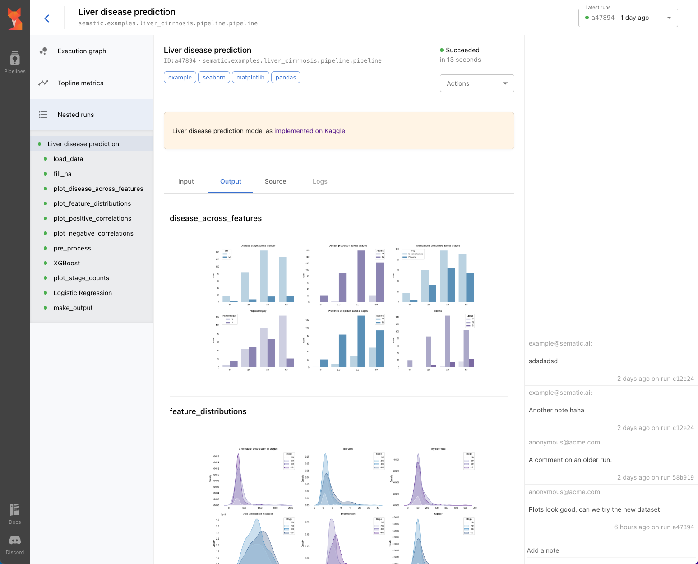
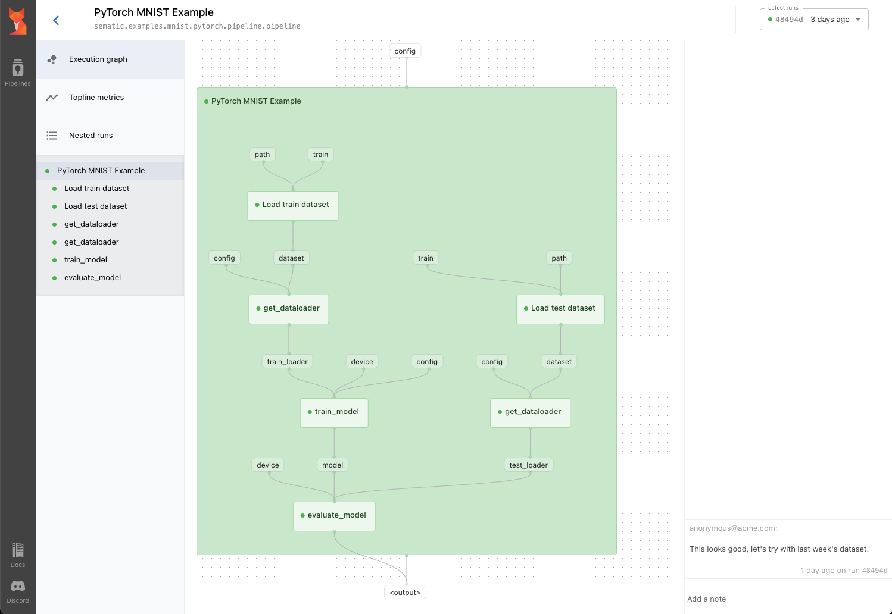

Sematic comes with a semantic UI that lets you do the following things:

* Track your pipelines execution
* Visualize and inspect the execution graph or your pipelines
* Track and visualize each Sematic Function's inputs and outputs
* Collaborate and share documentation, notes, and insights with your team
* [soon] Re-run/clone pipelines with different input configurations
* [soon] Schedule pipelines to keep models and dashboard fresh and relevant

## Pipeline View layout

You can see below the basic layout of the Pipeline View.

Let's go through each component of the view.

### Side Bar

At the far left, the dark side bar lets you return to the Home page, the Pipeline index, access these docs or join our [Discord
Server](https://discord.gg/ztnS9qaS).

### Pipeline Bar

At the very top, the horizontal bar provides baseline information about the Pipeline you are viewing. You can see the name you gave it in your code, as well as the pipeline's full import path.

### Latest Runs Dropdown

At the far left of the Pipeline Bar, you will find a dropdown menu with all the recent executions of your pipeline. You can quickly switch between different executions.

The six-character string you see in the dropdown corresponds to the first dix characters of the pipeline run ID. Every time you run the pipeline, a new item will appear in this dropdown.

### Menu Panel

The grey panel to the left is the Menu Panel. Three items are listed:

* **Execution graph** – this will open the Graph Panel in the central area. See [Graph Panel](#graph-panel).
* [Coming soon] **Topline metrics** – this will display plots of the main
  metrics of your pipeline across successive executions
* **Nested runs** – This lists all the nested runs of the your pipeline in a tree view. This is a summarized view of the execution graph visible in the [#graph-panel]. You can click and select any run to view them in the central [Run Panel](#run-panel)

### Graph Panel

The graph panel shows the execution graph of your pipeline as a series of nested
Directed Acyclic Graph (DAG).

Each box with a status pin (the tiny green spots) corresponds to a Sematic
Function's run. You can click on them to open the corresponding run in the
central [Run Panel](#run-panel) in order to inspect its details.